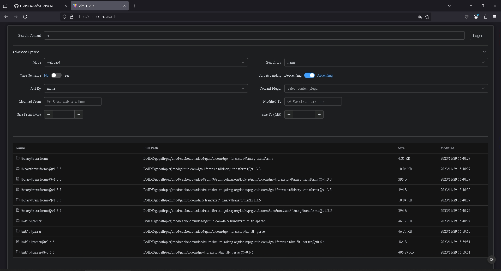

# FilePulse 简介

FilePulse 是一款高效的对象信息搜索工具，对象包括 **文件** 和 **文件夹**，支持 **中文搜索**、**拼音搜索**、**拼音首字母搜索
**。  
文件夹大小将 **实时计算**，文件修改也会 **自动同步** 到本系统。  
系统支持 **HTTP2/HTTP3** 协议。

在 **7900x + DDR5（未超频）+ M.2 PCIe 4.0 固态硬盘** 及 **Windows 11** 系统下，FilePulse 可以实现：

- **2.8 秒** 全硬盘扫描 **220 万个对象**
- **单次查询** 性能 **25 毫秒**

未来计划增加 **毫秒级文件内信息搜索** 功能。

**本软件的初衷在于主在研究高效的搜索算法，现在是一个DEMO版本，功能可能会一些BUG，前端也很丑，我毕竟不是专业学平面设计的，后续会慢慢完善。
**

## 下载地址

- [https://github.com/FilePulseSoft/FilePulse/releases](https://github.com/FilePulseSoft/FilePulse/releases/)

## 与everything的比较

| 测试项目                           | FilePulse (自带统计文件夹大小) | Everything1.4+统计文件夹大小 | Everything1.5+统计文件夹大小 |
|--------------------------------|-----------------------|-----------------------|-----------------------|
| 220万文件扫描全盘速度+构建存储结构速度          | 2.82秒                 | 7.176秒                | 3.63秒                 |
| 220万文件查询一个大小写不敏感字母并按照大小排序      | 40.05毫秒               | 20.17毫秒               | 23.3毫秒                |
| 220万文件查询两个大小写不敏感字母并按照大小排序      | 24.64毫秒               | 19.68毫秒               | 18.39毫秒               |
| 220万文件查询三个大小写不敏感字母并按照大小排序      | 24.19毫秒               | 17.95毫秒               | 19.41毫秒               |
| 220万文件查询拼音一个大小写不敏感字母并按照大小排序    | 59.71毫秒               | 不原生支持                 | 不原生支持                 |
| 220万文件查询拼音两个大小写不敏感字母并按照大小排序    | 38.59毫秒               | 不原生支持                 | 不原生支持                 |
| 220万文件查询拼音三个大小写不敏感字母并按照大小排序    | 40.10毫秒               | 不原生支持                 | 不原生支持                 |
| 220万文件查询拼音首字母一个大小写不敏感字母并按照大小排序 | 58.40毫秒               | 不原生支持                 | 不原生支持                 |
| 220万文件查询拼音首字母两个大小写不敏感字母并按照大小排序 | 41.62毫秒               | 不原生支持                 | 不原生支持                 |
| 220万文件查询拼音首字母三个大小写不敏感字母并按照大小排序 | 38.12毫秒               | 不原生支持                 | 不原生支持                 |

## 打赏，有你的支持是我前进的动力

---

## 启动说明

### 方案一：极简启动

1. **以管理员权限运行 `FilePulse.exe`**。
2. **打开浏览器**，打开`https://127.0.0.1`点击`高级`点击`继续前往`，然后输入默认用户名和密码都是`root`即可进入搜索页面

### 方案二：使用自带开发证书启动

0. **设置受信任证书**将certs中证书设置为受信任证书（可选）
1. **修改 `hosts` 文件**，添加：127.0.0.1 test.com
2. **编辑 `config.json`**，在 `drive_list` 中添加要搜索的盘符。
3. **以管理员权限运行 `FilePulse.exe`**。
4. **打开浏览器**，打开`https://test.com`然后输入默认用户名和密码都是`root`即可进入搜索页面

---

## 使用说明

### 搜索参数

| 参数                         | 说明                                              |
|----------------------------|-------------------------------------------------|
| **Search Content（搜索内容）**   | 关键字，每个条目以 `\|` 分割                               |
| **Mode（搜索模式）**             | `正则` 或 `通配符`                                    |
| **Search By（搜索项目）**        | `name`（对象名）或 `full path`（完整路径）                  |
| **Case Sensitive（大小写敏感）**  | `是/否`                                           |
| **Sort By（排序方式）**          | `name` / `full path` / `size` / `modified`      |
| **Sort Ascending（排序顺序）**   | `Ascending`（升序） / `Descending`（降序）              |
| **Content Plugin（内容插件）**   | `pinyin`（拼音搜索） / `pinyin_first_letter`（拼音首字母搜索） |
| **Modified From（修改时间左边界）** | 为空表示所有过去的修改时间                                   |
| **Modified To（修改时间右边界）**   | 为空表示所有到现在的修改时间                                  |
| **Size From（对象大小左边界）**     | 单位 `MB`，可为空                                     |
| **Size To（对象大小右边界）**       | 单位 `MB`，可为空                                     |

### 搜索结果

在搜索结果条目上 **右键** 可进行：

- 复制对象名
- 复制对象路径
- 在系统管理器中定位文件
- 远程下载文件

**界面信息：**

- **左下角**：显示当前搜索匹配的总条目数
- **右下角**：分页数量与当前页号

---

## 快捷键

| 快捷键                                 | 说明                |
|-------------------------------------|-------------------|
| `Alt + 1` / `Alt + 2` / `Alt + 3`   | 切换 Content Plugin |
| `Alt + Page Up` / `Alt + Page Down` | 切换分页              |

---

## 高级使用

### **信任证书**

可手动将自带的 **开发证书** 添加为 **受信任证书**。

### **更换证书**

自带证书为 **开发证书**，如需更换真实证书：

1. 替换 `certs` 目录下的文件。
2. 修改 `static` 目录下的前端 `test.com` 为你的域名。

### **开启 HTTP3**

默认同时开启 **HTTP2 / HTTP3**，但由于开发证书问题，可能会自动降级为 **HTTP2**。  
更换为 **真实证书** 后，即可正常使用 **HTTP3**。

---

## 相对于其他同类产品的优势

1. **核心算法自主可控**，未套壳任何现成的磁盘搜索系统。
2. 支持 **高性能拼音搜索**、**拼音首字母搜索**、**中文搜索**。
2. **支持 HTTP2 / HTTP3 协议**，可 **远程操作** 与 **远程复杂查询**，未来将支持 **远程播放**。
3. **文件夹大小实时计算**，所有数据 **实时同步**。
4. **内存动态增减**，当大量文件删除时，内存会 **自动回收**。
5. **支持暗色模式**

---

## 未来计划

- **毫秒级文件内信息搜索** 功能。
- **优化启动时瞬时内存占用**（涉及架构重构）。
- **进一步优化启动时间和搜索时间**。
- **支持远程文件播放、远程编辑、远程差异同步**。

## 动画教程

录像会消耗性能，所以录像中显示的性能会略低于实际性能。

## 界面截图

